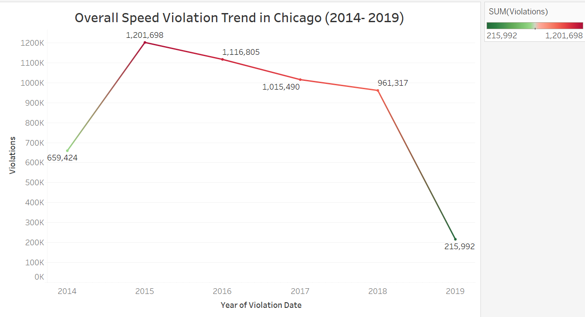
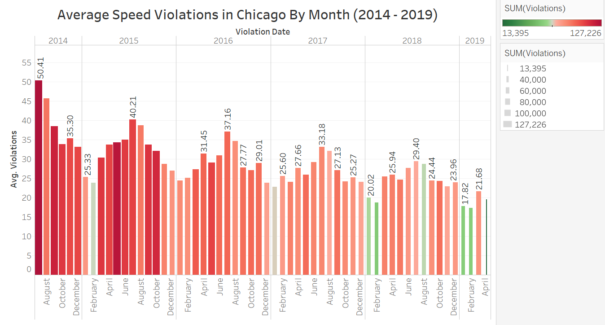
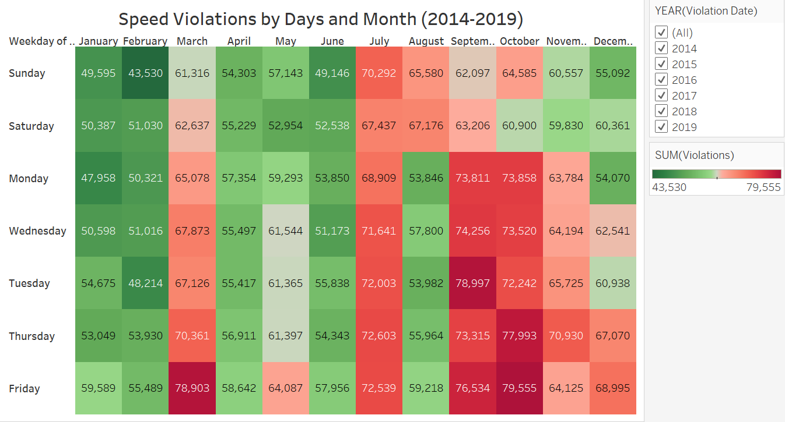
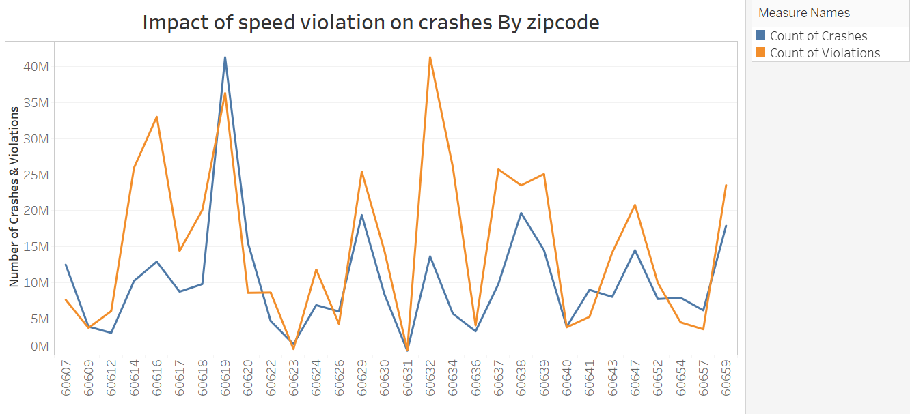
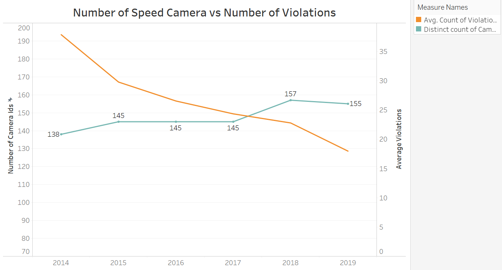
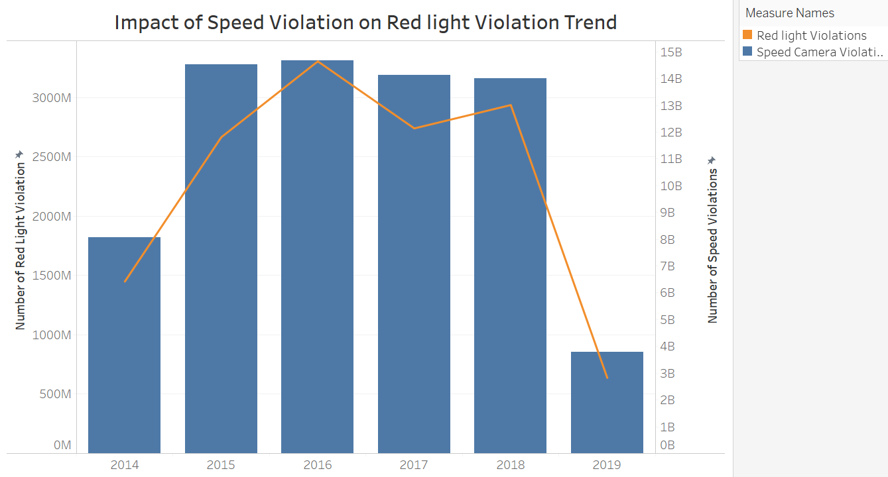

# Individual-Project-First-Version
## Individual Project Part 2 - First Version

##### Submitted By Vikita Nayak

#### Objective of Individual Project: 
- Visualize three aspects of the data in an interesting, non trivial, and somewhat unexpected fashion to the mayor of Chicago
- Document the "Making of"
- Road-map with future enhancements

### Analysis on Automated Speed Enforcement Program of Chicago

#### 1. Introduction of Automated Speed Enforcement Program of Chicago

Chicago experiences roughly 3,000 crashes annually between motor vehicles and pedestrians, about 800 of which involve children.

The Children’s Safety Zone Program protects children and other pedestrians by reminding motorists to slow down and obey speed laws – especially in school and park zones. Safety zones are designated as a 1/8th of a mile boundary around any Chicago parks or schools. 

The program uses enhanced signage and automated safety cameras to identify and ticket motorists who are breaking the law by exceeding the speed limits. The registered owner of the speeding vehicle will be issued the speeding ticket.

Revenue from the program will be used for programs that enhance the safety of children, including afterschool, anti-violence and jobs programs; crossing guards and police officers around schools; and infrastructure improvements, such as signs, crosswalk markings and other traffic safety improvements.

Speed is one of the biggest determinants in whether an accident results in a serious injury or fatality, and reducing speeds to the posted limits will save lives. The Children’s Safety Zone Program protects children and other pedestrians by reminding motorists to slow down and obey speed laws – especially in school and park zones.

Reference: https://www.chicago.gov/city/en/depts/cdot/supp_info/children_s_safetyzoneporgramautomaticspeedenforcement.html

### Approach for data analysis:

I tried to  look for the dataset giving infomration about the number of accidents/crashes in the areas where the speed camera have been installed. Because to measure the effectivity of the ASE program it is important to analyze whether speed violation has any impact on accidents. The main aim of the ASE program is to protect children and other pedestrians by reminding the driver to slow down their speeds and avoid accidents. 

Hence, I thought it is important to mergr the traffic crash dataset with the speed camera violation dataset as I mentioned in my previous submission.

#### 2. Dataset used for the analysis

- ##### Dataset 1 : Speed Camera Violation 
    - This dataset reflects the daily volume of violations that have occurred in Children's Safety Zones for each camera. 
    - The data reflects violations that occurred from July 1, 2014 until present, minus the most recent 14 days. 
    - This data may change due to occasional time lags between the capturing of a potential violation and the processing and determination of a violation. 
    - The most recent 14 days are not shown due to revised data being submitted to the City of Chicago. 
    - The reported violations are those that have been collected by the camera and radar system and reviewed by two separate City contractors.

- ##### Dataset 2 : Traffic Crashes - Crashes 
    - Crash data shows information about each traffic crash on city streets within the City of Chicago limits and under the jurisdiction of Chicago Police Department (CPD). 
    - Data are shown as is from the electronic crash reporting system (E-Crash) at CPD, excluding any personally identifiable information. Records are added to the data portal when a crash report is finalized or when amendments are made to an existing report in E-Crash.
    - About half of all crash reports, mostly minor crashes, are self-reported at the police district by the driver(s) involved and the other half are recorded at the scene by the police officer responding to the crash.
    - A traffic crash within the city limits for which CPD is not the responding police agency, typically crashes on interstate highways, freeway ramps, and on local roads along the City boundary, are excluded from this dataset.
    
- ##### Dataset 3 : Red light Violation
    - This dataset reflects the daily volume of violations created by the City of Chicago Red Light Program for each camera. 
    - The data reflects violations that occurred from July 1, 2014 until present, minus the most recent 14 days. 
    - This data may change due to occasional time lags between the capturing of a potential violation and the processing and determination of a violation
    -
    
- ##### Reason to use these datasets:
It is very important to know the impact of ASE program after it is implemented. The main aim of this program is to reduce speed violations and accident occuring due to speed in the Child Safe zones. By using the speed violation dataset, we will know the number of violations at different areas. The traffic crashes dataset contains infomration about the crashes occured in different areas. By using both datasets, we will know the impact of the ASE program like whether the speed violations has decreased over the period of time and accidents are also decreasing for a particular area.

###### NOTE: I extracted zipcodes from the ward dataset and vlookuped in the Dataset 1 & 3 

- ##### Merging the Dataset 1 & 2:
    - Extracted the zipcodes (by writing code in python using google APIs) of the crash location from latitude adn longitude given in the dataset
    - Data cleaning in python and excel to remove the null values and extra columns
    - Merged the two dataset using zipcodes to find out trend of speed violation and crashes on a zipcode of speed violation and other analysis
    - Merging these datasets took a lot of time (~ 10 hours) as the code generates the zipcode using the location code using google API
    
- ##### Merging the Dataset 1 & 3:
    - Merged the datasets based on the extracted zipcodes from ward dataset
    
    
    

- Ward Dataset Reference : https://data.cityofchicago.org/Facilities-Geographic-Boundaries/Ward-Offices/htai-wnw4
- Data set 1 Reference :https://data.cityofchicago.org/Transportation/Speed-Camera-Violations/hhkd-xvj4)
- Data set 2 Reference : https://data.cityofchicago.org/Transportation/Traffic-Crashes-Crashes/85ca-t3if)
- Data set 3 Reference : https://data.cityofchicago.org/Transportation/Red-Light-Camera-Violations/spqx-js37

#### 3. Part 1 Exporatory Data Analysis Summary

- 1. It has been observed during the Part 1 of this project that overall, the speed violation has been decreased from 2014-2019

   

- 2. The montlhy speed violation trend shows that speed violation number start increasing in the month of July and gradually decrease till December

    

- 3. Maximum speed violations occur on Fridays of almost all months

    
    
    
    
    
    
#### NOTE: Above three graphs are from Individual Project Data Exploratory part. So, I have not submitted the tableu link for these graphs as I already did it during my last submission. The graphs are placed here just to recall what I did in the first part.

#### 4. Deeper Analysis on merged dataset

##### 4.1 Insight 1 : Does decreasing speed violation also reduces the number of accidents in that area?

The first question came to my mind is the impact of speed violation trend on the number of crashes in that particular area. We saw above that the overall speed violation number decreases. The graph below shows the trend of number of crashes in the same area of speed violation.

##### Visualization 1

#### Observation:
-  The graph shows the number of crashes and number of Violation by zipcode.
-  From the graph, it can be said that the number of crashes in an area is closely related to the number of speed violations in that particular area
-  As the number of speed violations decreases, the number of crashes also decrease
-  Similarly, as the number of speed violations increases, the number of crashes also increase

After the installation of the ASE program, it has been observed that the number of speed violations has been reduced over the period of time(From graph: Overall Speed Violation trend). Aslo, it is observed that number of speed violation are closely related to the nummber of accidents which means the number of accidents are decreasing as the number of speed violation reduces. This clearly shows that the ASE program is effective as it is able to reduce the number of speed violation and number of crashes in the areas where speed cameras has been installed.

##### Recommendation / Insight : Keeping above explanation and analysis in to consideration, I will recommend the mayor to install speed cameras to the areas where they have not been installed as this program reduces the number of speed violation and number of accidents in the areas where the speed cameras are installed.This will help us to reduce the overall number of accidents in chicago and making the 'Vision Zero' successful.

#### 4.2 Insight 2: Does installing new cameras under ASE program reduces the number of speed violations?

Since the installing cameras adds costs to the city, I wanted to analyze whether adding new cameras under ASE program reduces the number of speed violations and indirectly reduces number of crashes. Below graph shows this trend

##### Visualization 2

#### Observation:

- The graph shows that the number of camera installation under ASE program has increased from 2014 to 2019
- It also shows that the average number of speed violations are decreasing from 2014 to 2019
- It clearly shows that there is an impact of more camera installation under ASE program
- The drivers are now more aware of the ASE program and are driving carefully to avoid the speed violation tickets

##### Insights: This graph shows how effective the ASE program is where adding the new cameras has reduced the number of speed violation and which can reduce the number of crashes. Also, during year 2015 to 2017, though the camera number were constant, the number of speed violation kept decreasing. One can onfer that during the initial phase of the camera installation, not many people were aware of this system but with time, they became aware of this system and hence the speed violation decreases though the speed camera instalation number were constant for some period

#### 4.3 Does Speed violation also causes red light violation?

I am interested to analyze this area  as I think red light violation is one of the major reasons for crashes. I want to see the impact of implementing the ASE program on red light violation as majority of the red light violations occur due to high speed. Hence, below is the graph of impact of speed camera violation on red light violation

##### Visualization 3

#### Observation:

- The graph shows the correlation between speed camera violation and the red light violation over the period of time.
- It is evident that the red light violations increase with the increase in speed camera violation and decrease with the decrease in the speed camera violations

#### Insights: We found that with decrease in the number of speed violations, there is decrease in  the number of red light violations which is one of the major causes of the crashes. The lesser speed violation leads to lesser red light violation as the speed is in control and the drivers are able to stop on the red light. High speed vehicles are not easier to stop on red light and this leads to increase in the number red light violations

### Conclusion

With this analysis, we found 3 interesting insights 

- There is an impact of speed camera violation number on the number of crashes in a particular area
- The ASE program awarness has increased among the drivers from 2014 to 2019 reducing number of speed violations
- One of the major causes of crashes is red light violation captured by red light program. Red light violation is relatedto the speed violation. As the speed camera violation decreases, thereis a decrease in red light violations.

#### Tableau Public Link

#### Future Enhancement for Revised Version

- The crash dataset is not the complete dataset as the code generation took really long so, I have to miss 25% of the records. I would like to collect entire crash dataset and analyze the severity of the accidents
- I would also like to check other datasets which has amount genrated with these speed violation tickets
- I would like to analyze the revenue generated with this system and the amount spent on this program (Cost Benefit Analysis)

